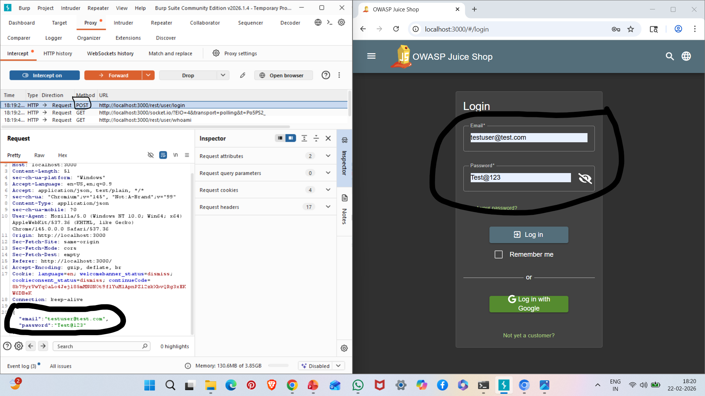

# A02: Cryptographic Failures

## Vulnerability Description

Cryptographic Failures occur when sensitive data such as credentials, session tokens, or personal information is transmitted or stored without proper encryption.

In this case, user credentials (email and password) were intercepted in plaintext using Burp Suite while the application was running over HTTP.

---

## Affected Endpoint

POST /rest/user/login

---

## Steps to Reproduce

1. Start OWASP Juice Shop:

npm start

2. Configure browser proxy to:

127.0.0.1:8080

3. Open Burp Suite Community Edition.

4. Enable Intercept.

5. Attempt login in Juice Shop using any email and password.

6. Observe the intercepted HTTP request in Burp Suite.

---

## Evidence

### Intercepted Login Request Showing Credentials in Plaintext

---

## Impact

- User credentials exposed over unencrypted HTTP.
- Risk of Man-in-the-Middle (MITM) attacks.
- Sensitive data leakage.
- Potential account compromise.

---

## Risk Severity

High

---

## Mitigation Recommendations

- Enforce HTTPS using TLS.
- Redirect all HTTP traffic to HTTPS.
- Use strong encryption protocols.
- Avoid transmitting sensitive data in plaintext.
- Implement HSTS (HTTP Strict Transport Security).

---

## OWASP Reference

OWASP Top 10 – A02: Cryptographic Failures
