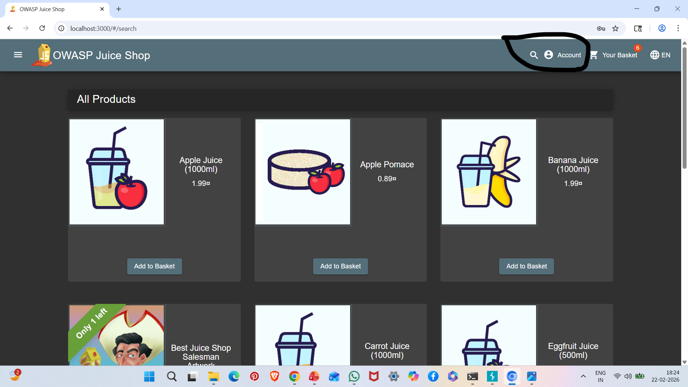

# A03: SQL Injection

## Vulnerability Description

SQL Injection occurs when untrusted user input is directly included in SQL queries without proper validation or sanitization.

Attackers can manipulate SQL queries to bypass authentication, extract sensitive data, or modify database contents.

In this case, the OWASP Juice Shop application was tested for SQL Injection using crafted payloads.

---

## Affected Endpoint

POST /rest/user/login

---

## SQL Injection Payload Used

' OR 1=1 --

---

## Steps to Reproduce

1. Start OWASP Juice Shop:

npm start

2. Configure Burp Suite proxy:

127.0.0.1:8080

3. Intercept login request.

4. Modify email field to:

' OR 1=1 --

5. Forward request.

6. Observe authentication bypass or abnormal response.

---

## Evidence

### SQL Injection Payload Intercepted

---

## Impact

- Authentication bypass
- Unauthorized access to user accounts
- Data extraction
- Database manipulation
- Full application compromise

---

## Risk Severity

Critical

---

## Mitigation Recommendations

- Use Parameterized Queries (Prepared Statements)
- Implement Input Validation
- Use ORM frameworks
- Apply Least Privilege principle
- Implement Web Application Firewall (WAF)

---

## OWASP Reference

OWASP Top 10 – A03: Injection
