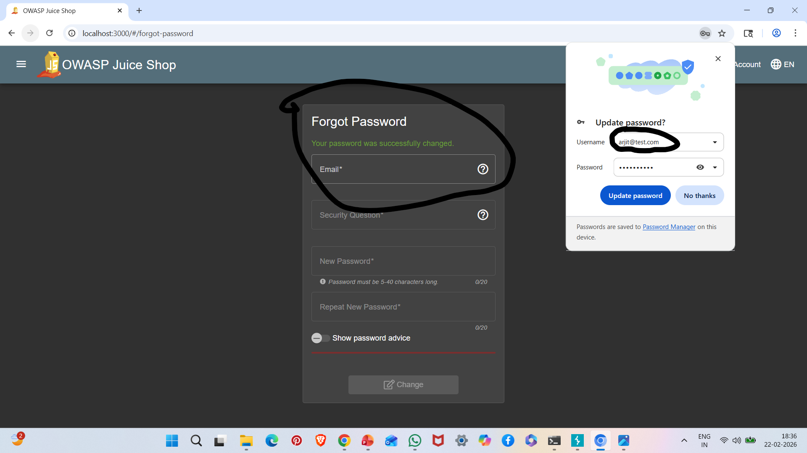

# A04: Insecure Design

## Vulnerability Description

Insecure Design refers to flaws in application architecture or business logic that allow abuse of system functionality.

Unlike coding vulnerabilities, this issue exists due to missing security controls during the design phase.

In this case, the application allows unlimited login attempts without rate limiting or account lockout.

---

## Vulnerability Type

Business Logic Flaw / Lack of Rate Limiting

---

## Steps to Reproduce

1. Start OWASP Juice Shop:

npm start

2. Attempt multiple failed logins continuously.

3. Observe that the system does not:
- Lock account
- Block IP address
- Apply delay
- Trigger CAPTCHA

4. Use Burp Intruder to automate login attempts.

---

## Evidence

### Multiple Failed Login Attempts Without Lockout

---

## Impact

- Enables brute-force attacks
- Password guessing attacks
- Account takeover risk
- Credential stuffing attacks

---

## Risk Severity

High

---

## Mitigation Recommendations

- Implement rate limiting
- Add account lockout mechanism
- Introduce CAPTCHA after failed attempts
- Monitor suspicious login behavior
- Apply adaptive authentication

---

## OWASP Reference

OWASP Top 10 – A04: Insecure Design
