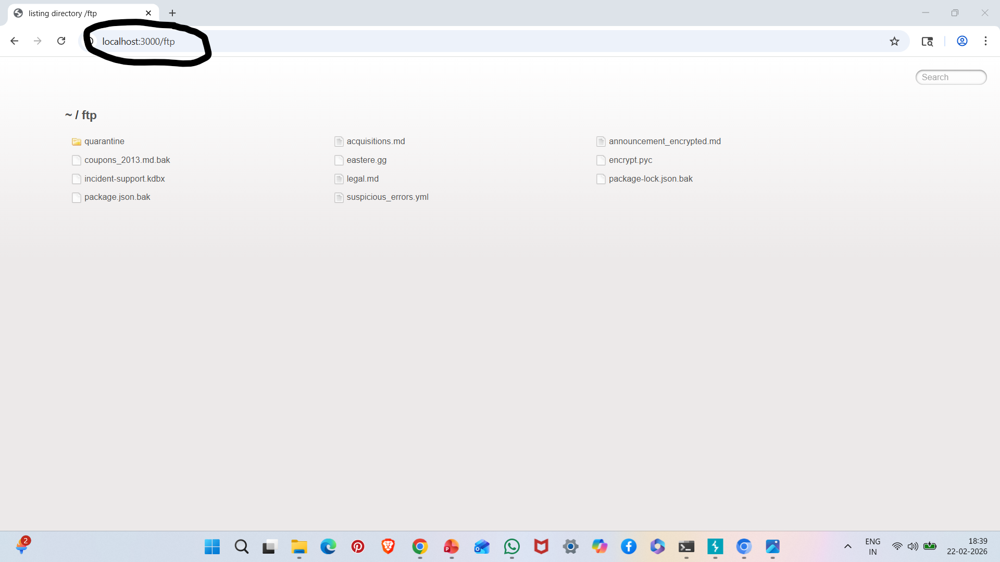
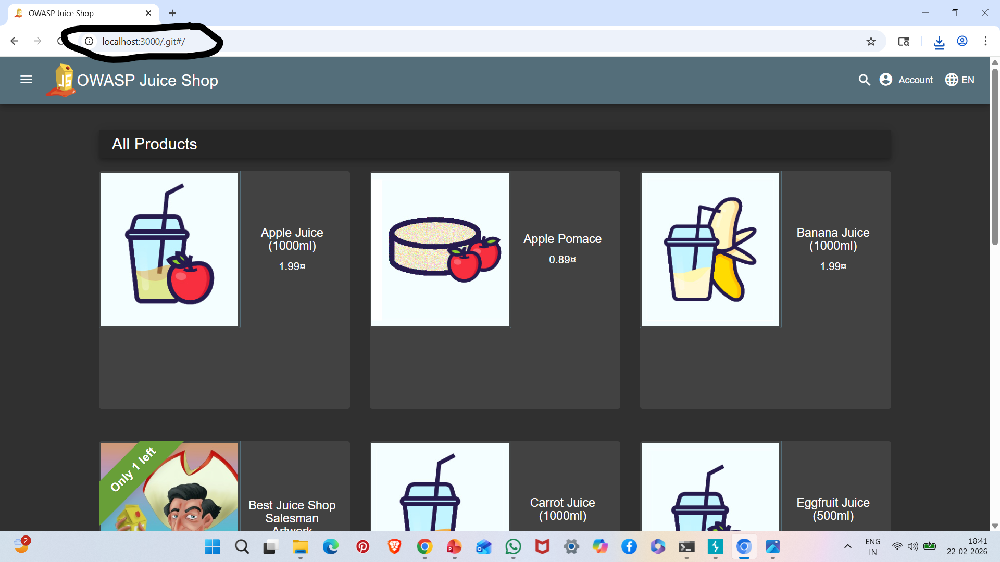

# A05: Security Misconfiguration

## Vulnerability Description

Security Misconfiguration occurs when applications, servers, or frameworks are improperly configured, leaving sensitive information exposed.

In this case, sensitive directories such as `/ftp` and `/.git` were accessible via browser.

---

## Affected Endpoints

http://localhost:3000/ftp  
http://localhost:3000/.git

---

## Steps to Reproduce

1. Start OWASP Juice Shop:

npm start

2. Open browser and navigate to:

http://localhost:3000/ftp

3. Observe exposed files.

4. Navigate to:

http://localhost:3000/.git

5. Observe accessible Git repository metadata.

---

## Evidence

### FTP Directory Exposure

### Git Repository Exposure

---

## Impact

- Exposure of internal files
- Disclosure of application source code
- Sensitive data leakage
- Information disclosure aiding attackers

---

## Risk Severity

High

---

## Mitigation Recommendations

- Disable directory listing
- Restrict access to sensitive paths
- Remove .git directory from production
- Apply secure server configuration
- Conduct regular configuration audits

---

## OWASP Reference

OWASP Top 10 – A05: Security Misconfiguration
