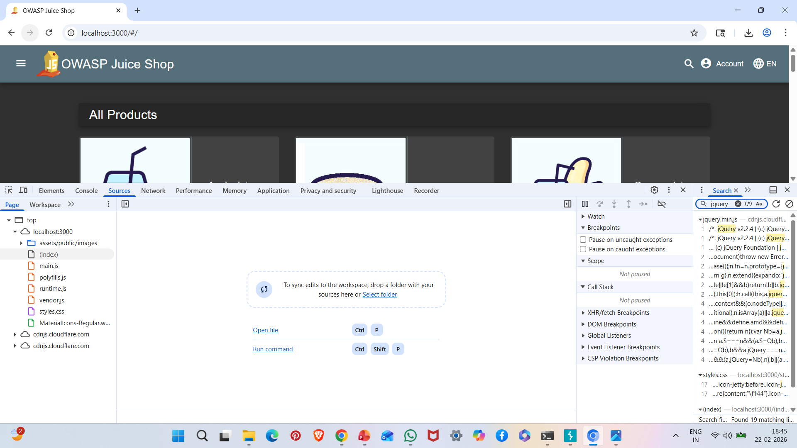
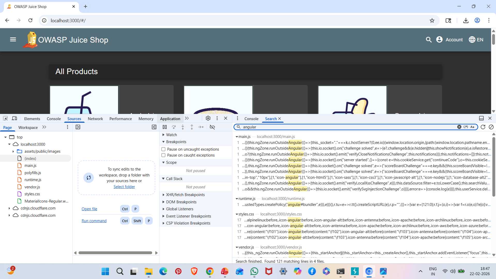
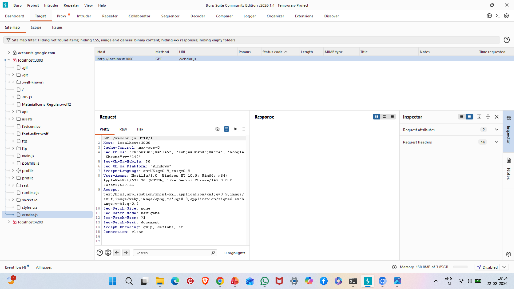
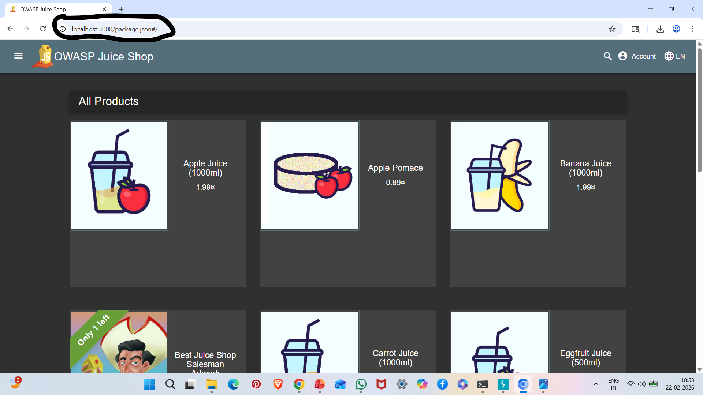

# A06: Vulnerable & Outdated Components

## Vulnerability Description

Vulnerable and Outdated Components refer to the use of software libraries or frameworks with known security vulnerabilities.

Attackers can exploit publicly disclosed vulnerabilities (CVEs) in outdated components.

In this case, the application was found using outdated JavaScript libraries.

---

## Components Identified

- jQuery v2.2.4
- Angular framework
- Bootstrap framework
- Exposed package.json file

---

## Steps to Reproduce

1. Start OWASP Juice Shop:

npm start

2. Open browser and press:

F12

3. Navigate to:
- Sources tab
- Search for library versions

4. Identify outdated versions such as:
- jQuery v2.2.4

5. Access:

http://localhost:3000/package.json

6. Observe exposed dependency information.

---

## Evidence

### jQuery Version Identified

### Angular / Bootstrap Version

### Vendor and Main JS Files

### Exposed package.json

---

## Impact

- Exploitation of known CVEs
- Remote code execution risk
- Cross-site scripting vulnerabilities
- Application compromise

---

## Risk Severity

Medium to High (Depends on CVEs)

---

## Mitigation Recommendations

- Regularly update dependencies
- Use dependency scanning tools
- Implement Software Composition Analysis (SCA)
- Monitor CVE databases
- Remove access to package.json in production

---

## OWASP Reference

OWASP Top 10 – A06: Vulnerable and Outdated Components
