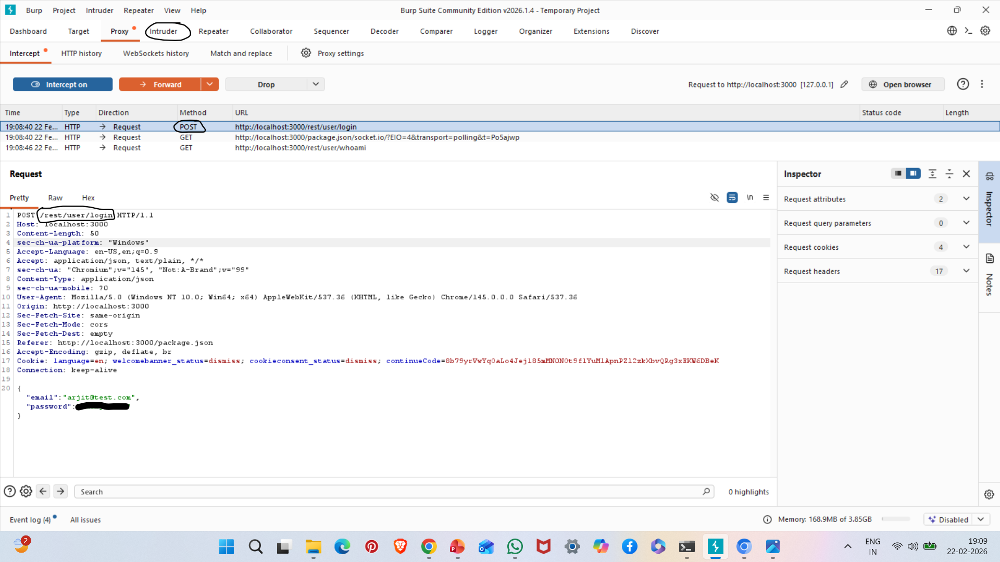
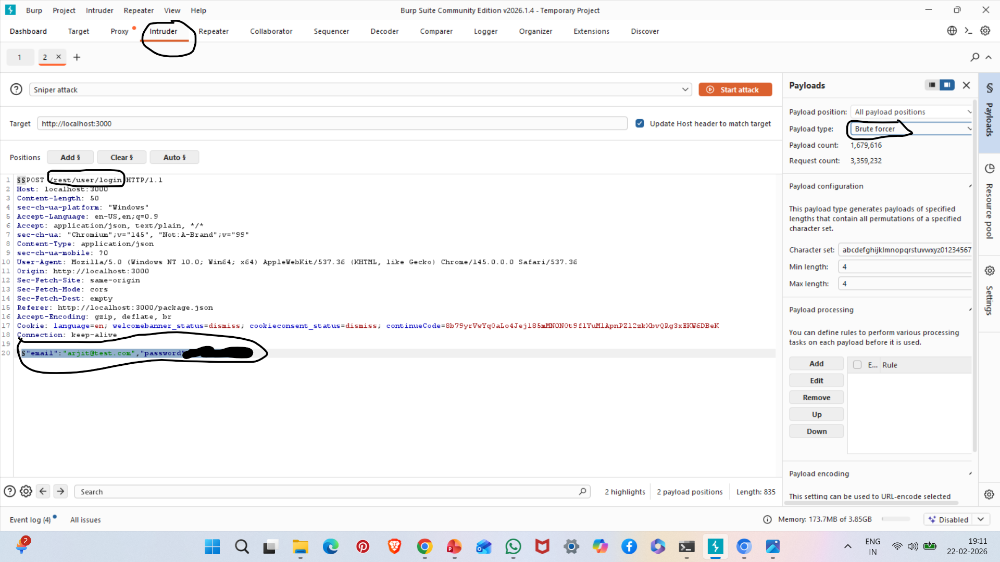
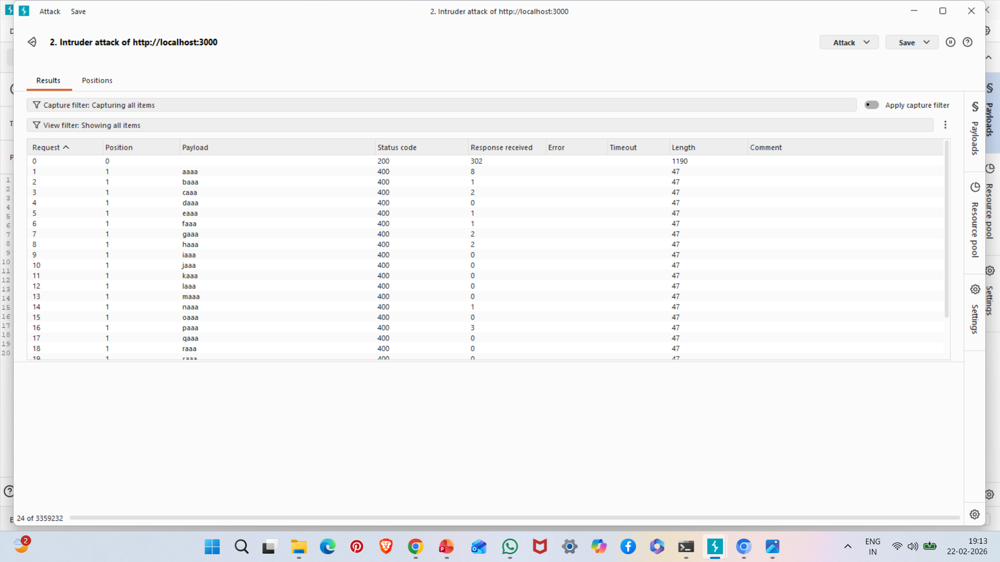

# A07: Identification and Authentication Failures

## Vulnerability Description

Authentication failures occur when an application improperly implements login mechanisms, allowing attackers to bypass authentication or perform brute-force attacks.

In this case, the login endpoint allowed repeated authentication attempts using Burp Intruder without strong protection.

---

## Affected Endpoint

POST /rest/user/login

---

## Attack Type

Brute Force Attack using Burp Intruder

---

## Steps to Reproduce

1. Start OWASP Juice Shop:

npm start

2. Configure browser proxy:

127.0.0.1:8080

3. Intercept login request.

4. Send request to Burp Intruder.

5. Add payload positions in password field.

6. Select payload type: Sniper / Brute Forcer.

7. Start attack.

8. Observe different HTTP status codes (200 / 400).

---

## Evidence

### Login Request Intercepted

### Burp Intruder Setup

### Brute Force Results

---

## Impact

- Account takeover risk
- Credential stuffing attacks
- Password guessing
- Unauthorized access

---

## Risk Severity

High

---

## Mitigation Recommendations

- Implement rate limiting
- Add account lockout after failed attempts
- Introduce CAPTCHA
- Enforce strong password policy
- Implement multi-factor authentication (MFA)
- Monitor suspicious login behavior

---

## OWASP Reference

OWASP Top 10 – A07: Identification and Authentication Failures
