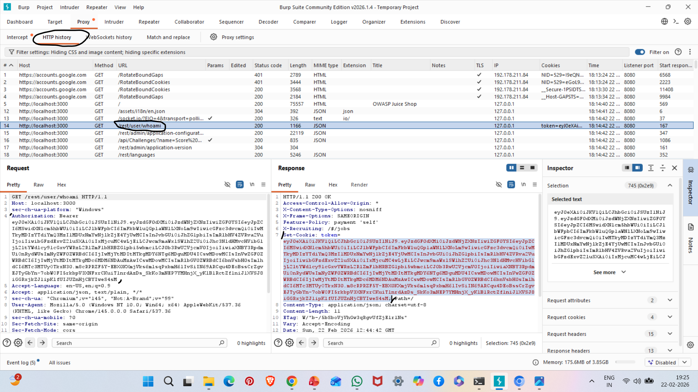
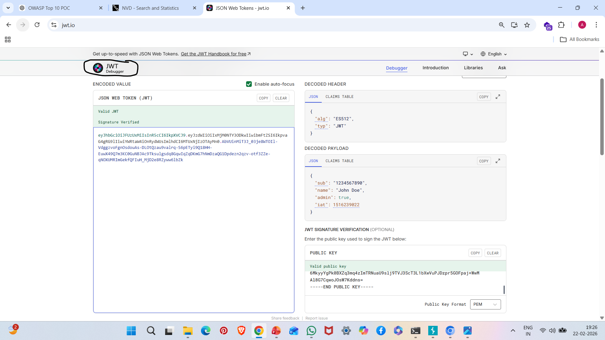

# A08: Software and Data Integrity Failures

## Vulnerability Description

Software and Data Integrity Failures occur when applications trust data without verifying its integrity.

JWT (JSON Web Token) vulnerabilities are common examples where token contents can be decoded and potentially manipulated.

In this case, the application exposes JWT token containing user role information.

---

## Affected Endpoint

GET /rest/user/whoami

---

## Observed Token Data

The JWT token contained:

- username
- admin: true
- issued at timestamp (iat)

---

## Steps to Reproduce

1. Start OWASP Juice Shop:

npm start

2. Login to application.

3. Open Burp Suite → HTTP History.

4. Locate:

/rest/user/whoami

5. Copy JWT token from response.

6. Paste token into:
https://jwt.io

7. Observe decoded payload showing user information and role.

---

## Evidence

### JWT Token from /whoami Endpoint

### Decoded JWT on jwt.io

---

## Impact

- Role manipulation risk
- Privilege escalation possibility
- Token tampering attacks
- Trust boundary violation

---

## Risk Severity

High

---

## Mitigation Recommendations

- Use strong secret keys
- Validate token signature strictly
- Avoid storing sensitive data inside JWT
- Implement token expiration
- Use secure signing algorithms (RS256)

---

## OWASP Reference

OWASP Top 10 – A08: Software and Data Integrity Failures
