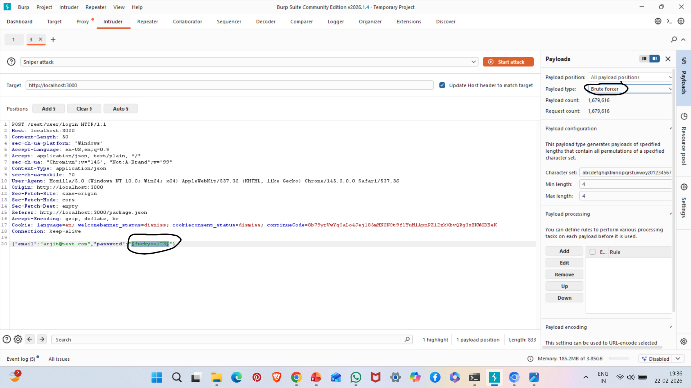
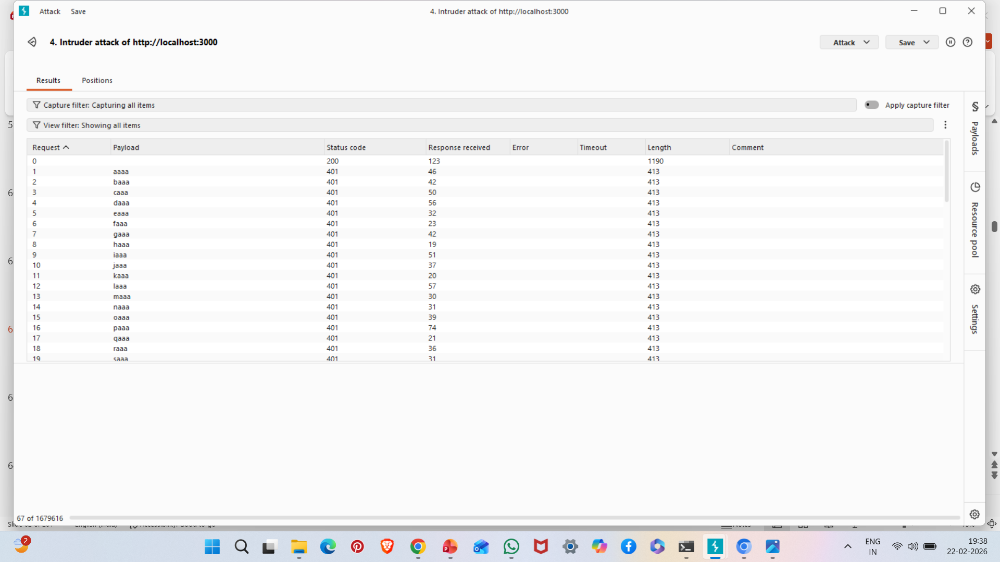

# A09: Security Logging and Monitoring Failures

## Vulnerability Description

Security Logging and Monitoring Failures occur when applications fail to detect, log, or alert on malicious activity.

Without proper logging, organizations cannot identify attacks or respond effectively.

In this case, multiple brute-force login attempts were performed without triggering alerts or account lockouts.

---

## Affected Endpoint

POST /rest/user/login

---

## Attack Type

Brute Force Login Attempts

---

## Steps to Reproduce

1. Start OWASP Juice Shop:

npm start

2. Configure Burp proxy:

127.0.0.1:8080

3. Send login request to Burp Intruder.

4. Perform multiple password attempts.

5. Observe:
- No account lockout
- No alert mechanism
- No visible logging

---

## Evidence

### Brute Force Setup in Burp Intruder

### HTTP Status Code Responses

---

## Impact

- Attacks go undetected
- No incident response trigger
- Account takeover risk
- Increased attack surface

---

## Risk Severity

Medium to High

---

## Mitigation Recommendations

- Implement centralized logging
- Enable real-time alerting
- Use SIEM tools
- Monitor authentication failures
- Implement anomaly detection
- Apply account lockout policies

---

## OWASP Reference

OWASP Top 10 – A09: Security Logging and Monitoring Failures
