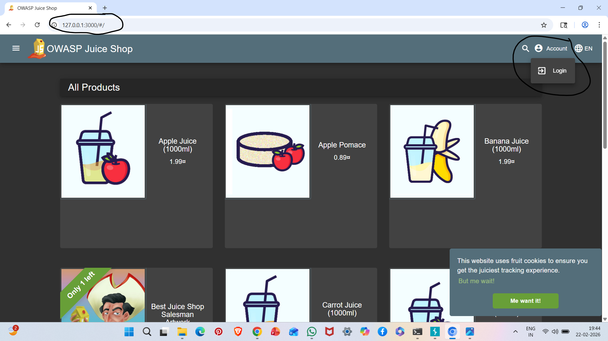

# A10: Server-Side Request Forgery (SSRF)

## Vulnerability Description

Server-Side Request Forgery (SSRF) occurs when an attacker can manipulate a server into making unauthorized requests to internal or external resources.

This can allow access to internal systems, cloud metadata services, or restricted endpoints.

In this lab scenario, the application allowed access to internal localhost resources.

---

## Target URL

http://127.0.0.1:3000/#/

---

## Steps to Reproduce

1. Start OWASP Juice Shop:

npm start

2. Access application using:

http://127.0.0.1:3000

3. Observe that internal server resource is accessible.

---

## Evidence

### Localhost Resource Access

---

## Impact

- Access to internal services
- Cloud metadata exposure
- Internal network scanning
- Data exfiltration risk

---

## Risk Severity

High

---

## Mitigation Recommendations

- Validate and sanitize user input
- Implement allow-list for URLs
- Block access to internal IP ranges
- Disable unnecessary internal services
- Use network segmentation

---

## OWASP Reference

OWASP Top 10 – A10: Server-Side Request Forgery
